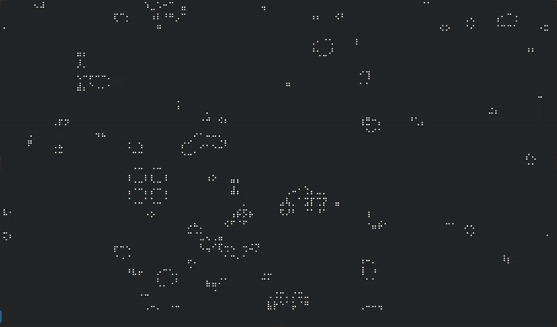

# Terminal Game of Life

Terminal [Conway's Game of Life](https://en.wikipedia.org/wiki/Conway%27s_Game_of_Life) using Unicode braille characters (4 x 2 logical pixels = 1 glyph) for high apparent resolution.
Initial configuration is generated randomly each time from a handful of popular patterns.



**License:** MIT. See `LICENSE.txt`.

## Files in this repo

- `braille_life.py`: main simulator and CLI (live play + bake-to-file).
- `core.py`: board primitives and generation logic.
- `render.py`: braille renderer.
- `place_patterns.py`: placement helpers.
- `ships.py`, `oscillators.py`, `still_lives.py`: pattern libraries.
- `play.sh`: player for baked `.txt` files (uses alternate buffer and fallbacks).

---

## Requirements

- Python 3.8+ (tested with Python 3.12.3)
- No dependencies required: This project uses only Python's standard library. 
- UTF-8 capable terminal and a monospace font with braille glyphs (e.g. Fira Code, Source Code Pro)


## Quick start

1. Create and activate a Python virtual environment (Linux/macOS):

```bash
python3 -m venv .venv
source .venv/bin/activate
```

On Windows (PowerShell):

```powershell
python -m venv .venv
.\.venv\Scripts\Activate.ps1
```

2. Make the player executable:

```bash
chmod +x play.sh
```

3. Run live / demo

```bash
# Live (auto-sized to terminal):
python3 braille_life.py

# Live with options (example):
python3 braille_life.py --wrap --rows 96 --cols 160 --ships 12 --gens 1000 --delay 0.06 --seed 42
```

or bake to a file and play

```bash
python3 braille_life.py --bake --outfile braille_life.txt --gens 400 --seed 42
./play.sh braille_life.txt 0.06
```

---

## CLI overview

Run `python3 braille_life.py --help` for the full list. Key options:

- `--rows`, `--cols`: logical grid size (each braille char = 4 rows x 2 cols). Defaults are derived from terminal size.
- `--ships`, `--still_lives`, `--oscillators`: how many random patterns to place.
- `--gens`: number of generations to run.
- `--delay`: seconds between frames for live play.
- `--seed`: RNG seed for reproducible runs.
- `--bake`: produce a baked `.txt` file (frames separated by `@@FRAME@@\n`).
- `--outfile`: baked output filename.
- `--wrap`: enable toroidal wrap-around neighbor logic.

Notes:
- The baker writes frames with the delimiter `@@FRAME@@\n`. `play.sh` expects that format.

---

## Troubleshooting & tips

- **Terminal size**: Because braille maps 4×2 logical pixels into one character, ensure your terminal is large enough to display `cols/2` characters and `rows/4` lines. If you see wrapping, either enlarge the terminal or reduce `--cols`/`--rows`.

- **Scrollbar growth**: Use `./play.sh` to play baked files so the alternate buffer is used; avoid `cat`ting the baked file.

- **Reproducibility**: Use `--seed N` to get repeatable placements.

---

## Developer notes

- `next_gen(board, wrap=False)` is in `core.py`. When `wrap=True` the grid behaves as a torus (neighbors computed modulo rows/cols).
- Patterns are in `ships.py`, `oscillators.py`, and `still_lives.py` as lists of `(row, col)` offsets. `place_patterns.py` handles random orientation and placement.
- `render.py` converts the logical grid to braille. The renderer pads a *copy* of the board to multiples of 4 rows and 2 cols; for perfect seam alignment in wrap mode, create the board with `rows` multiple of 4 and `cols` multiple of 2.

